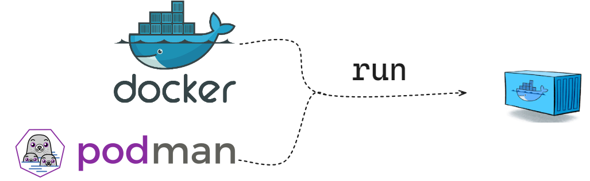

## Benefits of OCI

* We can always start a container using docker run `docker run dejanualex/dockersay:2.0`{{exec}}

* Maybe the image can be used by another container management tool...i.e. [podman](https://podman.io/) `podman run docker-daemon:dejanualex/dockersay:2.0`{{exec}}