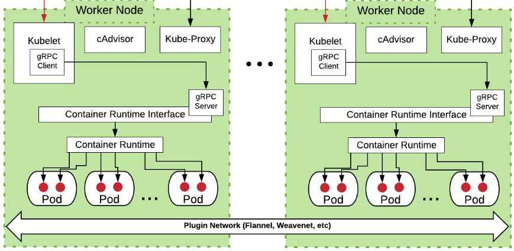

 

### kubelet 

* `kubelet` is the node agent that runs on each node.

* `kubelet` takes a set of PodSpecs that are provided through various mechanisms (primarily through the apiserver) and ensures that the containers described in those PodSpecs are running and healthy.

* the `kubelet` comunicates with the underlying container runtime (e.g., containerd, CRI-O) using the Container Runtime Interface (CRI) to start, stop, and manage containers.