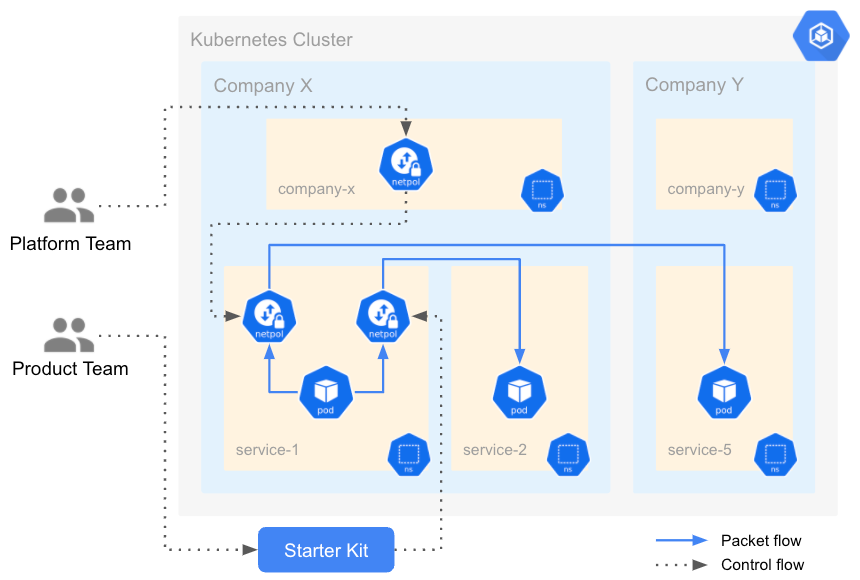

 

### Setup 

A Kubernetes **network policy** declares how a set of pods are allowed to communicate with each other and other network endpoint

In this scenario we'll learn how to leverage `networkpolicies.networking.k8s.io` for namespaces isolation.

