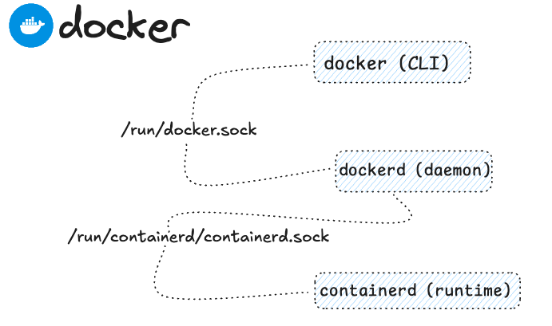

### Setup

Docker engine ubuntu setup:

* Check the status: 

Run command: `docker ps`{{exec}}, check the state of docker service using `systemctl` to query systemd journal: `journalctl  -xeu docker.service`{{exec}}.

Solution1

Check the status of <code>docker.socket</code> and use systemctl to start the unit <code>systemctl start docker.socket </code> 

Check images on the machine `docker image ls` start a container based on `dejanualex/dockersay:2.0` image, next user `curl` and leverage unix domain socket to list images.

Solution2

 **curl** can talk to a Unix Socket via the <code>--unix-socket</code> flag <code>curl --unix-socket /var/run/docker.sock http://localhost/images/json</code> 

