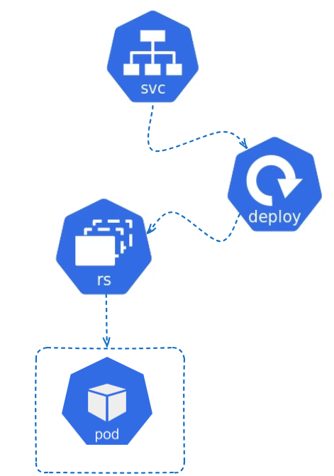

 

### WELL DONE !

* We've containerized the application into a Docker image and rolled out its deployment on Kubernetes.
* Kubernetes objects used: **deployment**(to mange the pod) and **service** (expose the application that is running inside the Pod).

