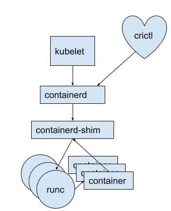

## Benefits of OCI




* Pulling an image using docker CLI `docker image pull docker.io/dejanualex/dockersay:2.0`{{copy}}

* Maybe install crictl

```bash
VERSION="v1.33.0"
wget https://github.com/kubernetes-sigs/cri-tools/releases/download/$VERSION/crictl-$VERSION-linux-amd64.tar.gz
sudo tar zxvf crictl-$VERSION-linux-amd64.tar.gz -C /usr/local/bin
rm -f crictl-$VERSION-linux-amd64.tar.gz
```{{exec}}

* Or with another CLI: `crictl pull docker.io/dejanualex/dockersay:2.0`{{copy}} and  check`crictl images`{{copy}}

* `crictl` uses the CRI to interface with containerd and can be used without any Kubernetes components. Usually is designed as a CLI for Kubelet CRI: `crictl pods`{{copy}}
*  Prior to the existence of CRI, container runtimes (e.g., docker, rkt) were integrated with kubelet through implementing an internal, high-level interface in kubelet. T
