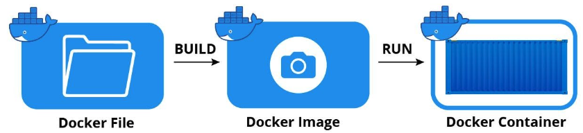

 

### Building images flavours?

* To start a build we need 

    - A Dockerfile is a text file containing instructions for building your source code 
    - A build context is the set of files that your build can access:

