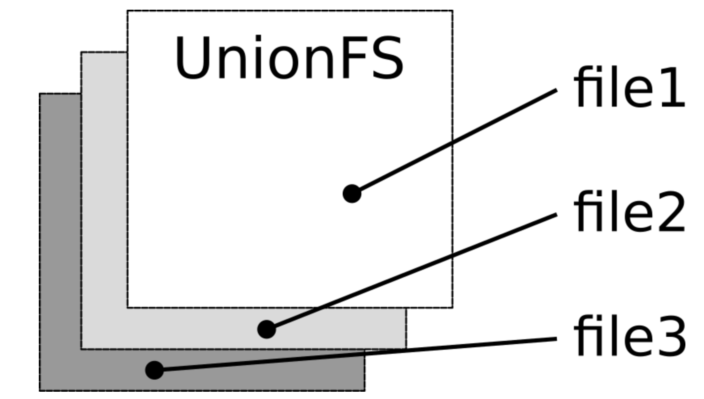

 

### What is a container image?

Images are immutable. Once an image is created, it can't be modified. You can only make a new image or add changes on top of it.

Container images are composed of layers. Each layer represents a set of file system changes that add, remove, or modify files.

The magic behind the scenes **UnionFS**:  Linux kernel feature, that allows contents from one file system to be merged with the contents of another, while keeping the "physical" content separate. The result is a unified file system, even though the data is actually structured in branches.

The idea here is that if you have multiple images with some identical data, instead of having this data copied over again, it's shared by using something called a layer.