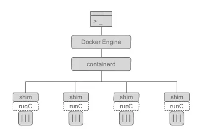

<br>

### Docker demo machine


* Docker: `Docker -> dockerd -> containerd -> runc`




```bash
# locate docker CLI
which docker
file /usr/bin/docker

# docker engine installed via package manager
apt list --installed  | grep docker

# look for docker service in systemd services 
systemctl list-units --type=service --state=running | grep docker

# docker service is actually dockerd (daemon process)
systemctl status docker.service

# query the systemd journal
journalctl -xeu docker.service
```

* Setup Docker's apt repo:

```bash
# Add Docker's official GPG key:
sudo apt-get update
sudo apt-get install ca-certificates curl
sudo install -m 0755 -d /etc/apt/keyrings
sudo curl -fsSL https://download.docker.com/linux/ubuntu/gpg -o /etc/apt/keyrings/docker.asc
sudo chmod a+r /etc/apt/keyrings/docker.asc

# Add the repository to Apt sources:
echo \
  "deb [arch=$(dpkg --print-architecture) signed-by=/etc/apt/keyrings/docker.asc] https://download.docker.com/linux/ubuntu \
  $(. /etc/os-release && echo "$VERSION_CODENAME") stable" | \
  sudo tee /etc/apt/sources.list.d/docker.list > /dev/null
sudo apt-get update
```

* Install Docker packages:
```bash
sudo apt-get install docker-ce docker-ce-cli containerd.io docker-buildx-plugin docker-compose-plugin
```
