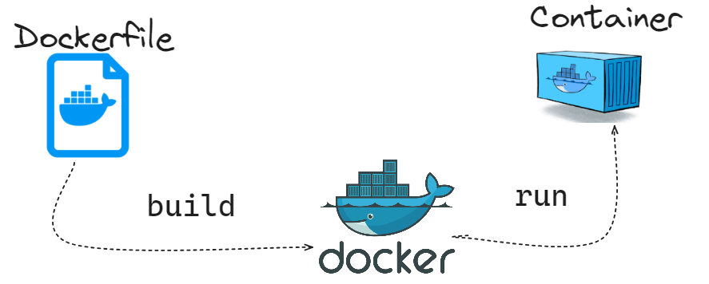

### Docker workflow

* Docker provides the ability to package and run an application in a loosely isolated environment called a **container**, and streamlines the development lifecycle.



* A Dockerfile contains instructions that are used to build Docker **images**.

* An **image** is a read-only template that provides instructions for creating a Docker container,and is a combination of a JSON manifest and individual layer files. A **container** is a runnable instance of an image.

* Let's illustrate with a straightforward example and containerize a simple application from the host machine: `file /usr/games/cowsay`{{exec}}

* Create a Docker file for **cowsay** app (Perl app capable of creating ASCII art representations featuring a cow along with a custom message), check usage:`/usr/games/cowsay helloo`{{exec}}

```bash
cat<<EOF>>Dockerfile
FROM ubuntu:14.04

# install cowsay: "cowsay" default installs to /usr/games
RUN apt-get update && apt-get install -y cowsay --no-install-recommends \
 && apt-get clean \
 && rm -rf /var/lib/apt/lists/*
ENV PATH $PATH:/usr/games

# configure container startup
ENTRYPOINT ["cowsay"]
CMD ["Hello World!"]
EOF
```{{exec}}

* Containerize the app `cowsayimage`, using as a build context the current directory containing the **Dockerfile**.Check if the image has been successfully built `docker images | grep cowsayimage`{{exec}} and start a container based on `cowsayimage` image: `docker run cowsayimage`{{exec}}. What happens?

<details>
<summary>Hint</summary>
 Build image <code>docker build -t cowsayimage -f Dockerfile .</code> 
</details>