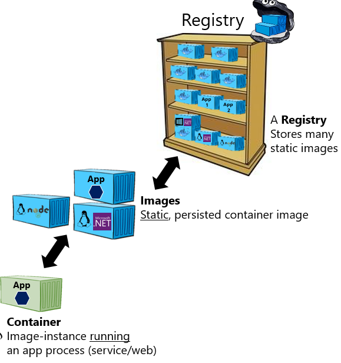

### Distribute image

* Registry: storing and distributing of container images and artifacts. Start a local registry based on Docker official [image](https://hub.docker.com/_/registry): `docker run -d -p 5000:5000 --restart always --name registry registry:2`{{exec}} check if it is running: `docker ps`{{exec}}

* Push the `cowsayimage` image to local registry.

* Try-it on your local machine [repo here](https://hub.docker.com/repository/docker/dejanualex/dockersay/general)
`docker run --rm dejanualex/dockersay:1.0`{{exec}} for arm64 and `docker run --rm dejanualex/dockersay:2.0`{{exec}} for amd64

Solution

 Retag image <code>docker tag cowsayimage localhost:5000/cowsayimage:1.0</code> push it to registry: <code>docker push localhost:5000/cowsayimage:1.0</code> and check the repos from registr: <code>curl localhost:5000/v2/_catalog</code>

