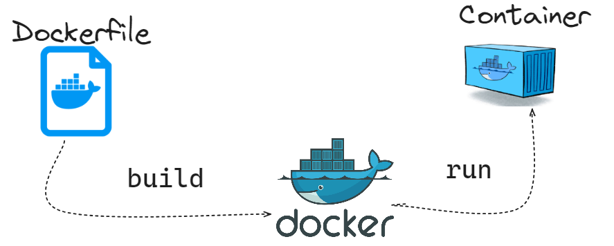

### Set of questions covering Docker containers and images

* Image: a read-only template with instructions for creating a container
* Container: a runnable instance of an image

⚠️ Docker runs processes in isolated environments called containers. A container is essentially a process running on a host system. You can always inspect either the underlying image and its layers or the running container itself.