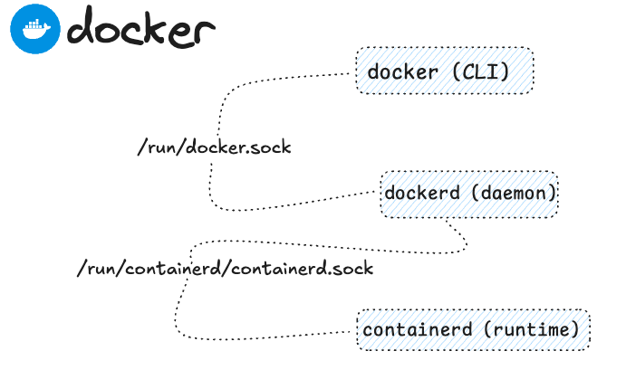

 

### WELL DONE !

* Docker needs:
    - a UNIX domain socket (or IPC socket) `/run/docker.sock` requiring either root permission, or docker group membership (alternative [rootless mode](https://docs.docker.com/engine/security/rootless/))
    - another socket `/var/run/containerd/containerd.sock` is needed to be used to talk with **containerd**
    - Docker engine [API Reference](https://docs.docker.com/reference/api/engine/version/v1.41/#tag/Container)

* Socket 101 play over loopback network interface

Create server  `nc -l 12345`{{exec}} 
Create client in another terminal session `echo "Hello World" | nc -q 2 localhost 12345`{{exec}}