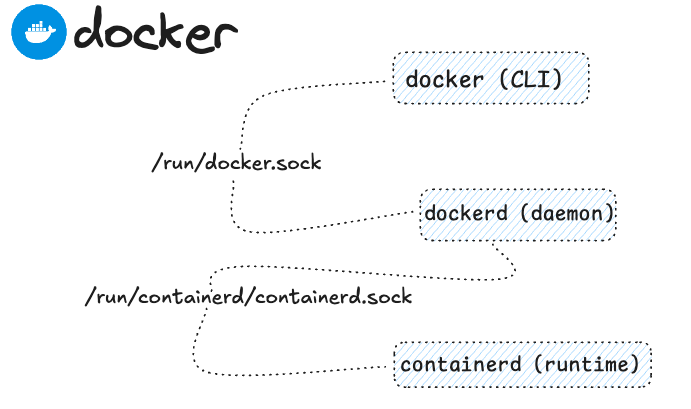

 

### What is Docker? 

Docker made accessible and consistent container deployment and execution across diverse machines…one might say that it “gave the fire to the ordinary people”.

In this scenario we have a ubuntu machine, where docker has been [installed using](https://docs.docker.com/engine/install/ubuntu/) the `apt` package manager.

Docker engine ubuntu setup:

