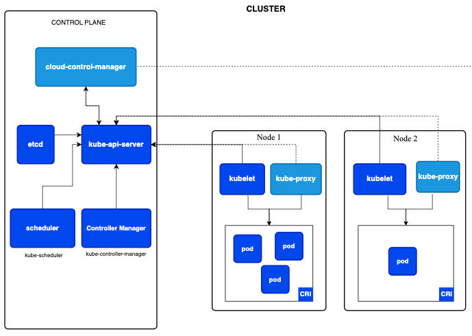

 

### Components 

* A Kubernetes cluster has two main components the **control plane** and the **data plane**

* Control-plane, includes:

    * [etcd](https://etcd.io/): a consistent and highly-available key value store used as Kubernetes backing store for all cluster data.
    * [API Server](https://kubernetes.io/docs/reference/command-line-tools-reference/kube-apiserver/): component of the Kubernetes control plane that exposes the Kubernetes API.
    * [Scheduler](https://kubernetes.io/docs/concepts/scheduling-eviction/kube-scheduler/): the component that schedules workloads to worker nodes, watches newly created pods. Scheduling refers to making sure that Pods are matched to Nodes so that Kubelet can run them.
    * [Controller Manager](https://kubernetes.io/docs/reference/command-line-tools-reference/kube-controller-manager/): the component that runs controller processes.

⚠️ The aforementioned components can be run as traditional operating system services (daemons) or as containers on the control-plane nodes.

* Data plane:

    * A set of **worker** nodes that run your workloads by placing containerized them into pods, and most importantly contains the services necessary to run pods: `kubelet`, `kube-proxy`, and `container-runtime` (implementing the Container Runtime Interface).

