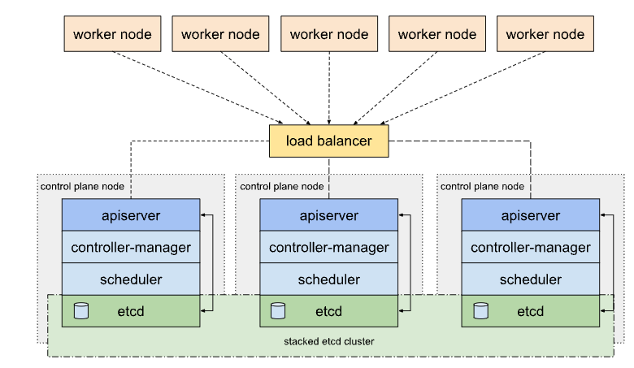

### Control plane

* We are currently on the control plane node.Each control plane node runs an instance of the `kube-apiserver`, `kube-scheduler`, and `kube-controller-manager` and `ectd`. Check with `kubectl  get po -n kube-system`{{exec}}

* When `etcd` runs in the cluster's control-plane nodes we're dealing with a **stacked** etcd topology, in contrast to configurations where etcd is external to the cluster.

* A stacked HA cluster architecture:

* `kubelet` is the primary "node-agent" that runs on each node (`which kubelet`{{exec}}), running as a service in the OS (*systemd* service), to check its status just: `systemctl status kubelet.service`{{exec}}

* The `kubelet` service needs to be up and running permanently. This way it will be able to execute pod requirements (take any new PodSpec definition from the Kubernetes API as soon as the Pod is scheduled to run on the node), manage resources and register a node with the *apiserver* (if needed).

* If the `kubelet` is not working properly, has crashed, or it is down for any reason, the Kubernetes node will go into a **NotReady** state, and no new pods will be scheduled on that node.

* On which node each component is running?

Hint

 Check on which node each component is running: <code>kubectl get po -n kube-system -owide </code> 

