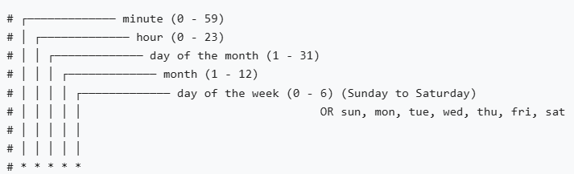

 

### Cronjobs

* A CronJob starts one-time Jobs on a repeating schedule.

* The `.spec.schedule` field is required. The value of that field follows the Cron syntax:

* CronJobs are particularly useful for running periodic tasks, such as backups, report generation, or sending notifications. They allow you to define a schedule for when the job should run, and Kubernetes takes care of creating and managing the job instances.

