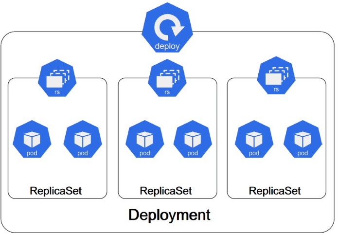

 

### Deployment 101 

* A Deployment manages a set of Pods to run an application workload

* Create a simple deployment based on `nginx:1.14.2` image

* Inspect the Pod and get the IP

* Scale the deployment to 3 pods
 
* Update the deployment to use `nginx:1.27.4-alpine-slim` image

* the `kubelet` comunicates with the underlying container runtime (e.g. containerd, CRI-O) using the Container Runtime Interface (CRI) to start, stop, and manage containers.