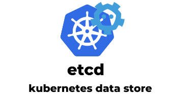

 

### etcd 

* **etcd** is a consistent and highly-available key value store used as Kubernetes backing store for all cluster data;

* **etcd** a leader-based distributed system. Ensure that the leader periodically send heartbeats on time to all followers to keep the cluster stable;

* with a focus on being: Simple: well-defined, user-facing API (gRPC) Secure: automatic TLS with optional client cert authentication;

