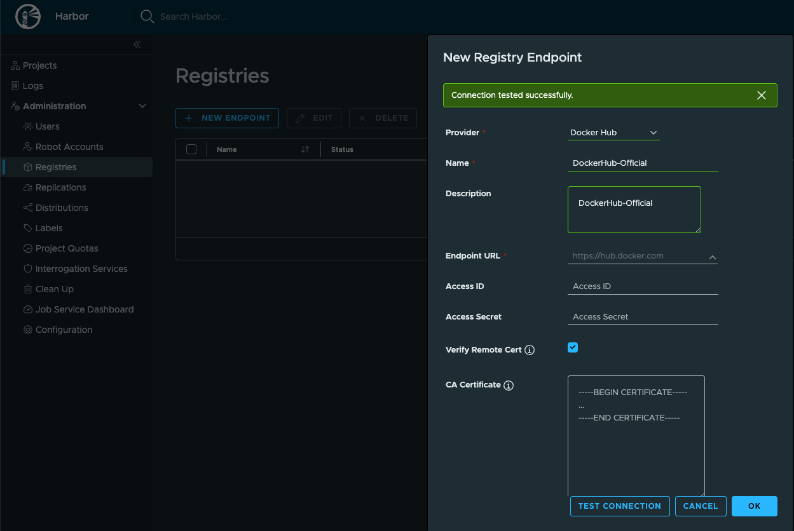
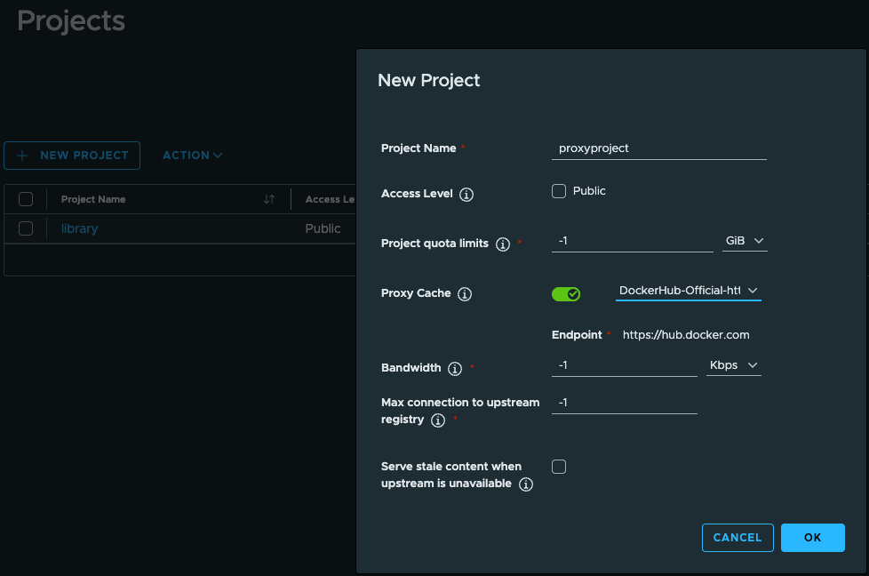
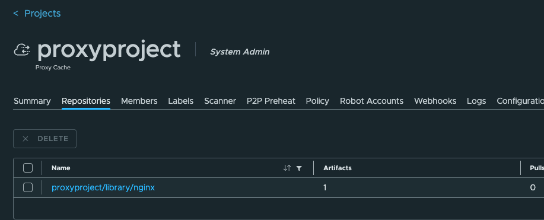

### Using Harbor as a proxy-cache

* When configured as a proxy cache, Harbor sits between your users or systems and external public registries. Instead of each system accessing the public registry directly, Harbor acts as a smart intermediary.

* Download Harbor chart

```bash
helm repo add harbor https://helm.goharbor.io
helm fetch harbor/harbor --untar
```
* Install harbor

```bash
# install a release in the default namespace
helm install harbor-release ./harbor \
  --set expose.type=clusterIP \
  --set expose.tls.auto.commonName=localhost \
  --set externalURL=https://localhost:8443

# verify installation
helm list 
kubectl get po

# port-forward bind all interfaces
kubectl port-forward --address 0.0.0.0 services/harbor 8080:443
```

* Get the provisioned external URL:

```bash
export url="https://b8d41e0788ff-10-244-8-169-8080.spca.r.killercoda.com/"

# get URL from browser then update current release i.e. 98bf0b64edb5-10-244-10-178-8088.spca.r.killercoda.com 
helm upgrade harbor-release ./harbor  --reuse-values --set expose.tls.enabled=false  --set externalURL=$url

# port forward HTTP port 80
kubectl port-forward --address 0.0.0.0 services/harbor 8080:80
```

* Configure Harbor as a proxy cache (use Docker Hub as external registry) . Navigate to Administration > Registries > New Endpoint and add **Docker Hub** provider




* Create a project named `proxyproject`. We’ll then pull the nginx image, which is **not yet available** in Harbor. Now that the proxy cache is set up, let’s interact with it.



* In a new tab pull `nginx` image and check in harbor the `proxyproject` repos

```bash

# Login with Harbor12345
docker login 98bf0b64edb5-10-244-10-178-8088.spca.r.killercoda.com -u admin

# pull nginx image from docker
# manifest <harbor>/<harbor-project>/<dockerhub-namespace>/<image>:<tag>
docker pull 98bf0b64edb5-10-244-10-178-8088.spca.r.killercoda.com/proxyproject/library/nginx:latest
```

