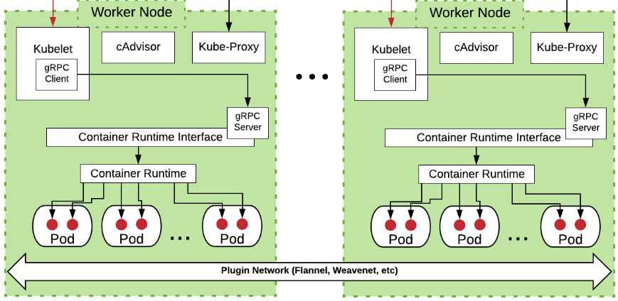

 

### kubelet 

* `kubelet` is the node agent that runs on each node, and:

* it takes a set of PodSpecs (YAML/JSON) that are provided through various mechanisms and ensures that the containers described in those PodSpecs are running and healthy,
 
* also it can register the node with the apiserver using one of: the hostname; a flag to override the hostname; or specific logic for a cloud provider.

* the `kubelet` comunicates with the underlying container runtime (e.g. containerd, CRI-O) using the Container Runtime Interface (CRI) to start, stop, and manage containers.