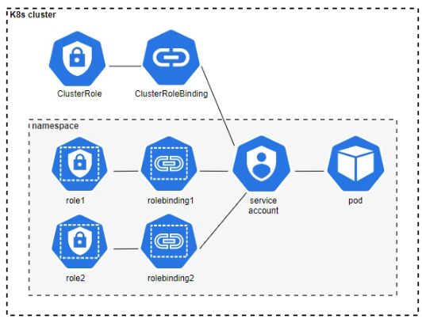

 

### RBAC 

* Kubernetes RBAC is a key security control to ensure that cluster users and workloads have only the access to resources required to execute their roles.

* The RBAC API declares four kinds of Kubernetes object: `Role`, `ClusterRole`, `RoleBinding` and `ClusterRoleBinding`.

* Ideally, minimal RBAC rights should be assigned to users and service accounts

