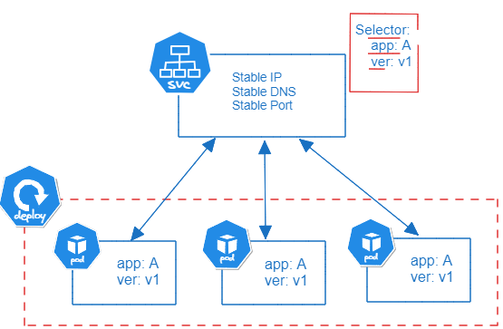

 

### Networking 

* A **service** is an object (network abstraction) that declares a common policy to access a set of **pods**
Exposes the pods under a single IP address and a single DNS name.

* The set of Pods targeted by a Service is usually determined by a selector.

* The controller for that Service continuously scans for Pods that match its selector, and then makes any necessary updates to the set of EndpointSlices for the Service.

