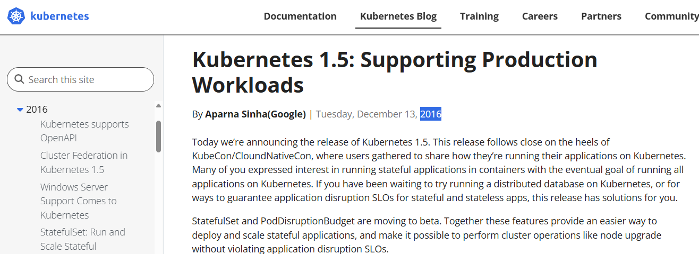

 

### StatefulSets

* A **StatefulSet** is a Kubernetes controller that is used to manage stateful applications. It provides guarantees about the ordering and uniqueness of Pods.

* StatefulSets are particularly useful for applications that require stable, unique network identifiers, persistent storage, and ordered deployment and scaling. Examples of such applications include databases (like MySQL, PostgreSQL), distributed systems (like Apache Kafka, Cassandra), and other stateful services.

* StatefulSets is a new feature implemented in Kubernetes 1.5 (prior versions it was known as PetSets) 
