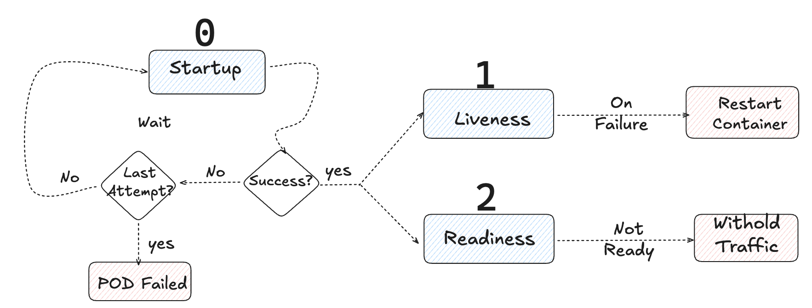

 

### Probes 

* **Probes** in Kubernetes are mechanisms used to check the health and readiness of a Pod's containers.

* They help Kubernetes manage the lifecycle of Pods by determining if a container is alive, ready or needs to be restarted.

* What happens if a container fails ?

* Types of probes: Startup, Liveness, Readiness 

