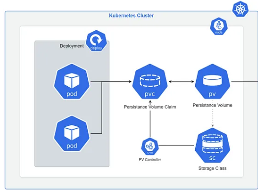

### Storage 

* There are multiple ways to provide both **long-term** and **temporary** storage to your Pods in your cluster.

* We have 2 main ways to consume storage in k8s:

    **Ephemeral** Volumes (Secrets/ConfigMap, [emptyDir](https://kubernetes.io/docs/concepts/storage/volumes/#emptydir))

    **Persistent** Volumes:
    - provisioned statically  (manually created by cluster admin)
    - provisioned dynamically (using storage class)  to enable dynamic storage the cluster admin needs to enable the DefaultStorageClass addmission controller

